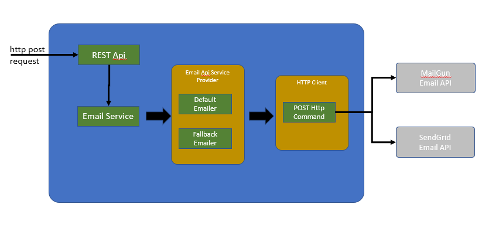

# Getting Started

The solution provides a REST API to send emails using third-party email service APIs.
#Requirements:
* The system will perform input validation
* On valid input, system will send email using one of the email service providers over HTTP call
* If the system fails to send email using the first email service provider due to unavailability, it will fallback and use the second provider  
# Solution:
The solution is designed based on SOLID and clean code principles. The API will accept HTTP POST request in JSON  with following parameters
```tos  - comma separated email addresses (required)
 ccs  - comma separated email addresses (optional)
 bccs  - comma separated email addresses (optional)
 sender – single email address (required)
 subject – text with max limit 50 characters (required)
 body – text with max limit 500 characters (required)
```
example of request body
```
{"tos":"shovonz@yahoo.com, monirul.mi2560@gmail.com", "sender":"shovonz@yahoo.com",  "subject": "Good Morning ", body": "Hi , This is a test body"}
```
# Solution overview:
 


# Components
| Component | Responsibility |
| --- | --- |	
| EmailController | 	It is spring RestController to accept user’s input, validate and on valid input delegate to EmailService | 
| EmailService | 	Delegates email sending to default EmailApiServiceProvider and on service unavailability of the default provider, it will fallback and use the second service provider | 
| EmailApiServiceProvider | 	Maintain list of Email API providers. In current implementation its is fixed with 2 provider, one as default and the other one as secondary. TODO : maintain a dynamic list based on configuration | 
| MailGunEmailer | 	Receives email request data and prepare request to support MailGun  API | 
| SendGridEmailer | 	Receives email request data and prepare request to support SendGrid  API | 
| HttpClientFactory | 	Based on apache HttpClient library, provides HttpClient from a managed pool of http clients. | 
| PostHttpCommand | 	Execute a http post request to external APIs | 


# Fail-Over Solution:
Fail-over solution is provided based on circuit-breaker patter. When default or the first provider fails to send email due to unavailability, the system will call for fallback provider.
Current solution used Spring-cloud Hystrix to handle fail-over.

# How to run
Gradle is required to build the solution. It is assumed gradle is available. Run the following gradle command
```
gradlew clean build
```
it will build an executable jar at /build/libs folder. Run the jar as follows,
```
java -jar emailservice-0.0.1-SNAPSHOT.jar
```

Make a HTTP POST request with json body at http://localhost:5000/sendemail

or alternatively a deployed version can be used at http://Emailservice-env.9c3fn5gaqx.ap-southeast-2.elasticbeanstalk.com/sendemail

# Note
I have removed the API keys for both providers from application.properties. You can use your or I can send through email.

# TODO
* Circuit-breaker not working properly sometime - need to find the root cause.
* Need to add more unit/functional test.
